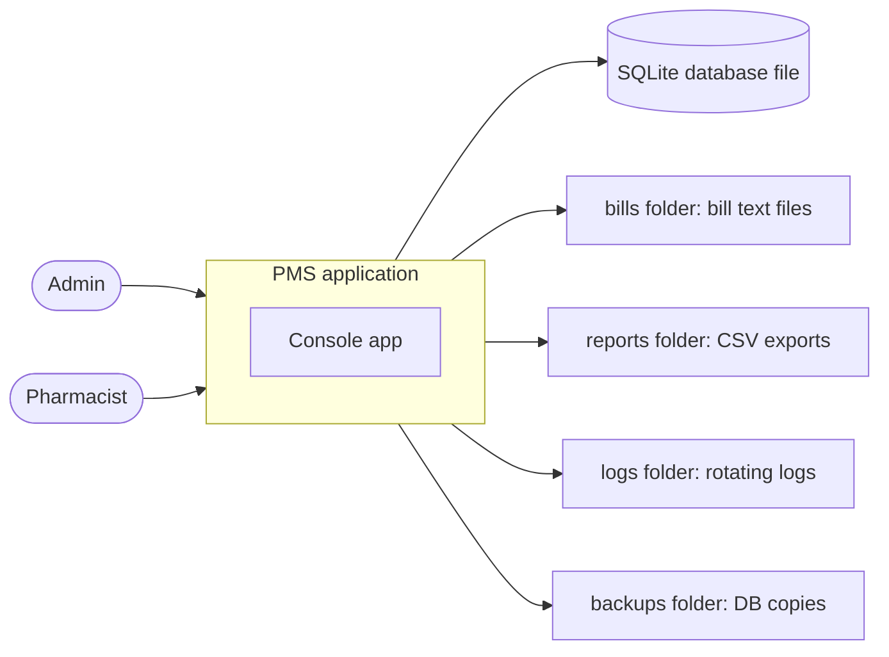
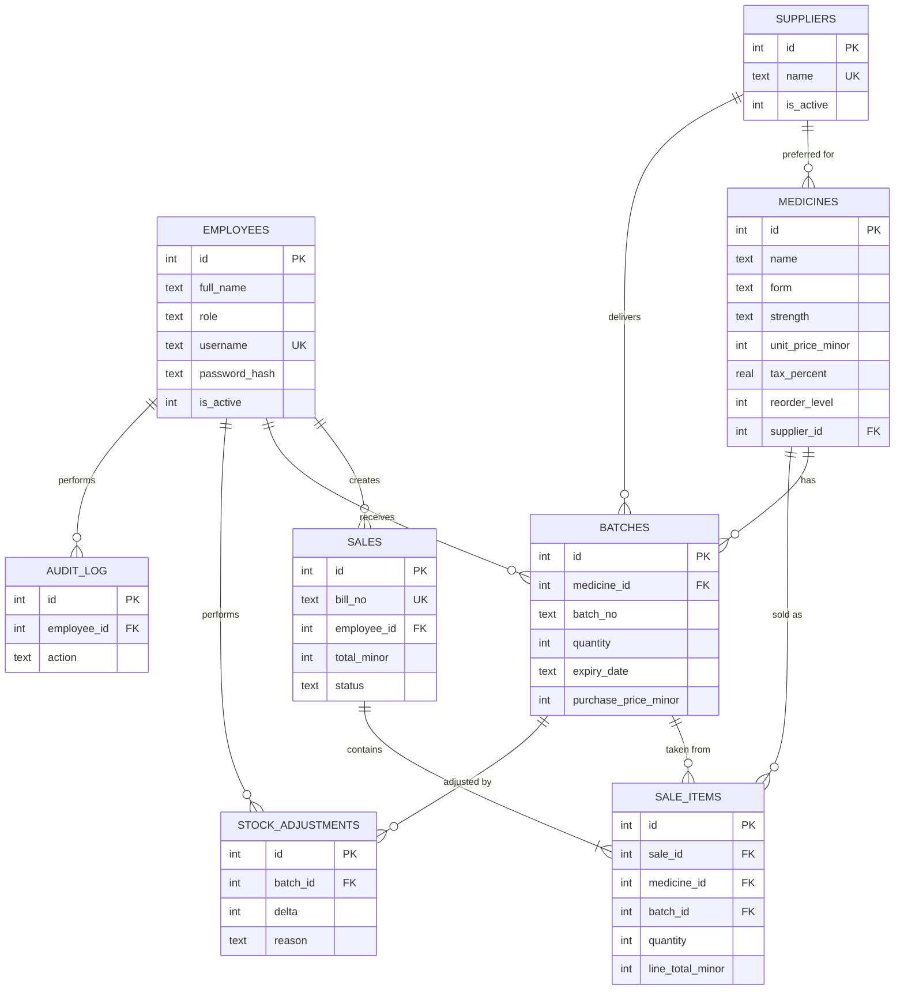
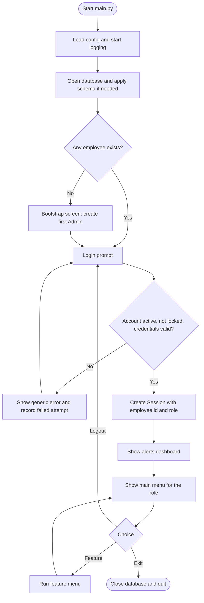
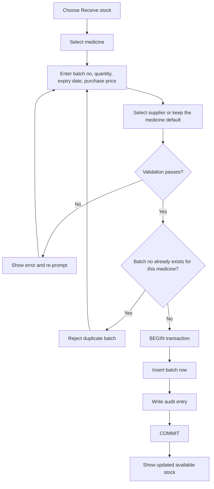
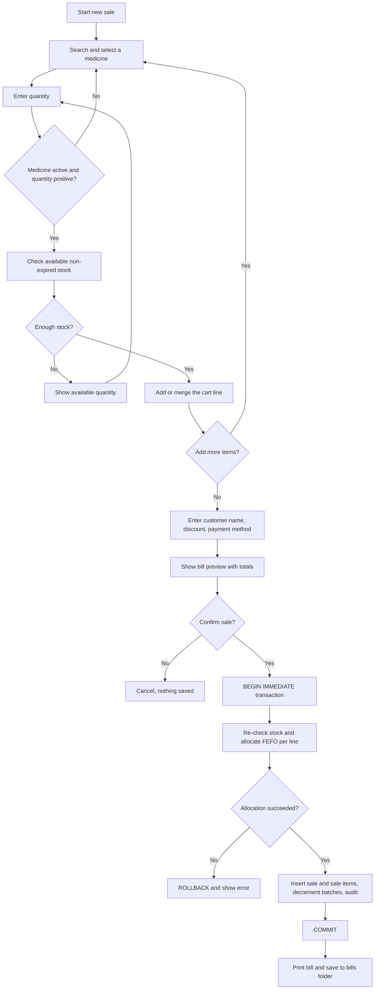
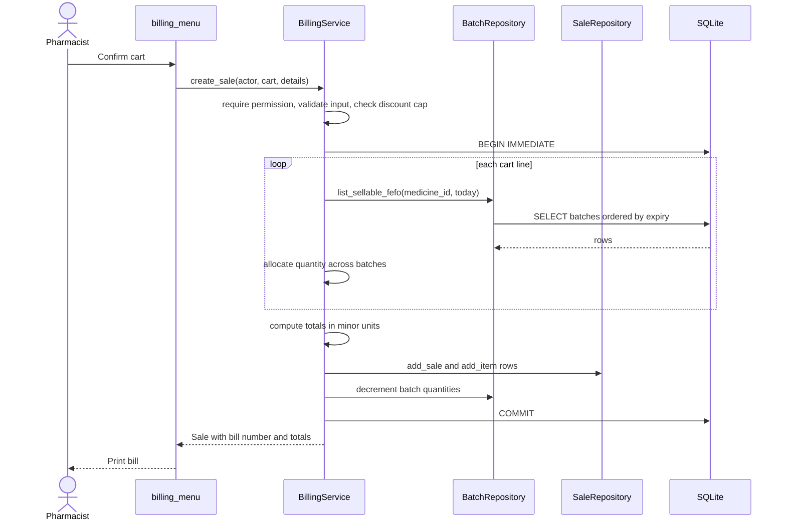
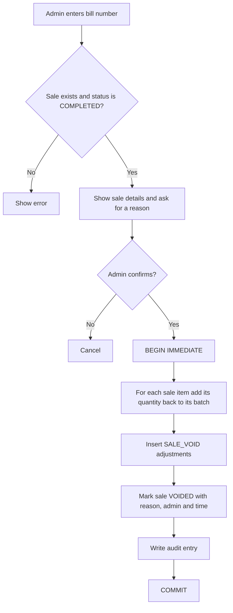
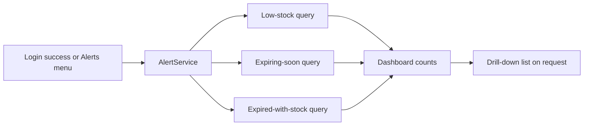
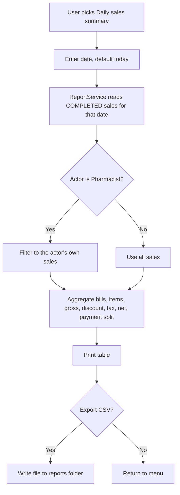
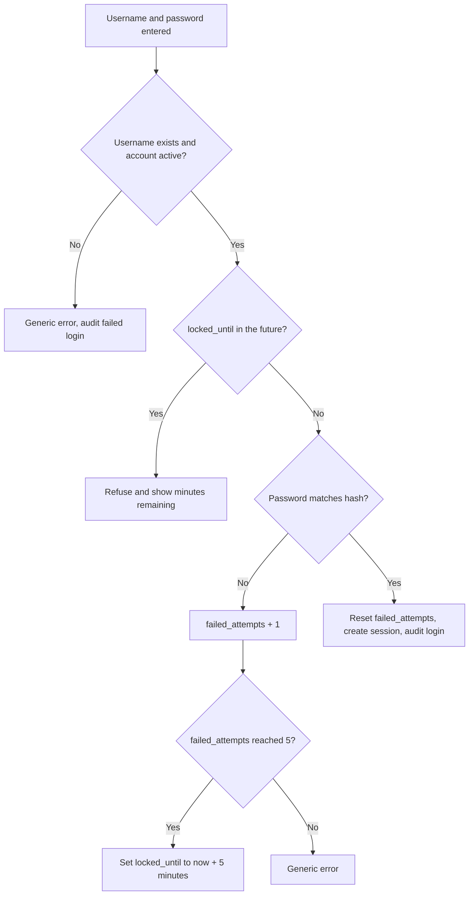

# Architecture: Pharmacy Management System (PMS)

| | |
|---|---|
| **Version** | 1.0 |
| **Date** | 2026-10-03 |
| **Related** | [README](../README.md), [PRD](prd.md), [implementation plan](implementation-plan.md) |

This document explains **how** PMS is built. The PRD explains **what** it must do. Diagrams use [Mermaid](https://mermaid.js.org/), which GitHub renders automatically.

---

## Table of Contents

1. [Architectural overview](#1-architectural-overview)
2. [System context](#2-system-context)
3. [Layers and dependency rules](#3-layers-and-dependency-rules)
4. [Modules and responsibilities](#4-modules-and-responsibilities)
5. [Data architecture](#5-data-architecture)
6. [Key workflows](#6-key-workflows)
7. [Core algorithms](#7-core-algorithms)
8. [Transactions and consistency](#8-transactions-and-consistency)
9. [Security architecture](#9-security-architecture)
10. [Error handling](#10-error-handling)
11. [Logging and audit](#11-logging-and-audit)
12. [Configuration](#12-configuration)
13. [Testing architecture](#13-testing-architecture)
14. [Extensibility](#14-extensibility)
15. [Architecture decisions](#15-architecture-decisions)

---

## 1. Architectural overview

PMS is a **single-process, layered application** with a local SQLite database.

| Concern | Choice |
|---|---|
| Style | Layered architecture: CLI, services, repositories, database |
| Patterns | Service layer (business rules), Repository (SQL isolation), Unit of work via `transaction()` context manager, dataclass models |
| Language and runtime | Python 3.10+, standard library only (plus `pytest` for development) |
| Storage | SQLite file at `data/pharmacy.db` |
| Interface | Menu-driven console |
| Deployment | Run locally with `python main.py` |

**Design goals:** business rules live in one place (services) so any future front end (GUI, web, API) reuses them; the database enforces integrity as a second line of defence; every layer is independently testable.

## 2. System context



There are no external network services. Everything is local files.

## 3. Layers and dependency rules

```
+--------------------------------------------------------------+
| CLI layer              pms/cli/                              |
| menus, prompts, tables, printing. NO business rules, NO SQL. |
+------------------------------+-------------------------------+
                               | calls
+------------------------------v-------------------------------+
| Service layer          pms/services/                         |
| business rules, authorization, validation, transactions,     |
| audit calls. NO print/input, NO raw SQL.                     |
+------------------------------+-------------------------------+
                               | calls
+------------------------------v-------------------------------+
| Repository layer       pms/repositories/                     |
| parameterised SQL only, rows to dataclasses. NO rules.       |
+------------------------------+-------------------------------+
                               | uses
+------------------------------v-------------------------------+
| Database               pms/database.py, pms/schema.sql       |
| connection, PRAGMAs, schema, transaction()                   |
+--------------------------------------------------------------+

Shared, importable from any layer:
models.py, exceptions.py, money.py, validators.py, config.py, logger.py
security.py (hashing and permission table) is used by services only.
```

**Rules (enforced in code review and by `AGENTS.md`):**

1. Dependencies point **downward only**. A repository never imports a service; a service never imports the CLI.
2. Only the **CLI** calls `print()` and `input()`.
3. Only **repositories** contain SQL. Every statement is parameterised.
4. Only **services** start and end transactions and check permissions.
5. Services receive an `actor` (a `Session`) as their first argument and raise exceptions; they never return error strings.

## 4. Modules and responsibilities

### 4.1 Shared modules

| Module | Responsibility |
|---|---|
| `config.py` | Constants: paths, shop name and address, currency symbol, `EXPIRY_WARNING_DAYS`, `MAX_PHARMACIST_DISCOUNT_PCT`, `PBKDF2_ITERATIONS`, lockout settings |
| `logger.py` | Configures the rotating file logger and a console handler |
| `exceptions.py` | Exception hierarchy (see [section 10](#10-error-handling)) |
| `money.py` | Convert between `Decimal` and integer minor units; half-up rounding; formatting |
| `validators.py` | Pure functions that check and normalise input (non-empty text, positive int, date, phone, email, password strength) and raise `ValidationError` |
| `models.py` | Dataclasses: `Employee`, `Supplier`, `Medicine`, `Batch`, `Sale`, `SaleItem`, `StockAdjustment`, `AuditEntry`, `Session`, `CartLine`, report row types |
| `security.py` | `hash_password`, `verify_password`, `PERMISSIONS` table, `require(actor, permission)` |
| `database.py` | `connect()` (sets `PRAGMA foreign_keys=ON`, row factory), `init_schema()`, `transaction()` context manager, schema version via `PRAGMA user_version` |

### 4.2 Repositories

| Repository | Tables | Typical methods |
|---|---|---|
| `EmployeeRepository` | `employees` | `add`, `get_by_id`, `get_by_username`, `list`, `update`, `set_active`, `count`, `count_active_admins`, `record_failed_login`, `reset_failed_logins` |
| `SupplierRepository` | `suppliers` | `add`, `get`, `list`, `update`, `set_active`, `count_medicines` |
| `MedicineRepository` | `medicines` | `add`, `get`, `search`, `list`, `update`, `set_active`, `exists_duplicate` |
| `BatchRepository` | `batches` | `add`, `get`, `list_for_medicine`, `list_sellable_fefo`, `available_stock`, `decrement`, `increment`, `set_quantity`, `low_stock`, `expiring`, `expired_with_stock` |
| `SaleRepository` | `sales`, `sale_items` | `next_bill_no`, `add_sale`, `add_item`, `get_by_bill_no`, `list_filtered`, `mark_voided`, `daily_summary`, `top_sellers`, `by_employee` |
| `AdjustmentRepository` | `stock_adjustments` | `add`, `list_for_batch` |
| `AuditRepository` | `audit_log` | `add`, `list_filtered` |

Repositories accept a connection (so services can group calls in one transaction) and return model objects or plain row types.

### 4.3 Services

| Service | Responsibility |
|---|---|
| `AuthService` | First-run bootstrap, login, lockout, change password, logout, session creation |
| `EmployeeService` | Employee CRUD with BR-16 checks; password reset |
| `SupplierService` | Supplier CRUD with validation and permission checks |
| `MedicineService` | Medicine CRUD, search, deactivate and reactivate, duplicate checks |
| `InventoryService` | Receive stock, list batches, adjust stock, write off expired batches |
| `BillingService` | Cart handling, FEFO allocation, totals, `create_sale`, `void_sale`, history, bill text rendering |
| `AlertService` | Low-stock, expiring-soon and expired-with-stock queries; dashboard counts |
| `ReportService` | Daily summary, valuation, range sales, top sellers, sales by employee, CSV export |
| `AuditService` | Write audit entries; list and filter (Admin) |

### 4.4 CLI

| Module | Responsibility |
|---|---|
| `app.py` | Start-up sequence, session loop, main menu per role |
| `console.py` | `ask_text`, `ask_int`, `ask_decimal`, `ask_date`, `ask_choice`, `confirm`, `print_table`, screen helpers |
| `*_menu.py` | One module per feature area; each function collects input, calls a service, prints the result, and catches `PMSError` |

## 5. Data architecture

### 5.1 Conventions

| Topic | Decision |
|---|---|
| Money | `INTEGER` minor units (for example paise). Columns end in `_minor`. Computed with `Decimal` in Python, never `float`. |
| Dates | `TEXT` in ISO `YYYY-MM-DD` (expiry, received on, report day). |
| Timestamps | `TEXT` in ISO `YYYY-MM-DD HH:MM:SS`, **local time**, because PMS runs on one machine. Switch to UTC if it ever becomes multi-device. |
| Booleans | `INTEGER` 0 or 1 with a `CHECK`. |
| Deletion | Soft delete through `is_active`. History rows are never deleted. |
| Foreign keys | Enforced: `PRAGMA foreign_keys = ON` on every connection. |
| Schema version | `PRAGMA user_version` (currently 1). Future migrations are numbered scripts. |

### 5.2 Entity-relationship diagram



### 5.3 Reference schema (`pms/schema.sql`)

`schema.sql` is the single source of truth. Changes to it must be reflected here and in the tests.

```sql
PRAGMA foreign_keys = ON;

CREATE TABLE employees (
    id              INTEGER PRIMARY KEY AUTOINCREMENT,
    full_name       TEXT    NOT NULL,
    phone           TEXT,
    role            TEXT    NOT NULL CHECK (role IN ('ADMIN', 'PHARMACIST')),
    username        TEXT    NOT NULL UNIQUE COLLATE NOCASE,
    -- format: pbkdf2_sha256$<iterations>$<salt_hex>$<hash_hex>
    password_hash   TEXT    NOT NULL,
    is_active       INTEGER NOT NULL DEFAULT 1 CHECK (is_active IN (0, 1)),
    failed_attempts INTEGER NOT NULL DEFAULT 0,
    locked_until    TEXT,
    hired_on        TEXT    NOT NULL DEFAULT (date('now', 'localtime')),
    created_at      TEXT    NOT NULL DEFAULT (datetime('now', 'localtime'))
);

CREATE TABLE suppliers (
    id             INTEGER PRIMARY KEY AUTOINCREMENT,
    name           TEXT    NOT NULL UNIQUE COLLATE NOCASE,
    contact_person TEXT,
    phone          TEXT,
    email          TEXT,
    address        TEXT,
    is_active      INTEGER NOT NULL DEFAULT 1 CHECK (is_active IN (0, 1)),
    created_at     TEXT    NOT NULL DEFAULT (datetime('now', 'localtime'))
);

CREATE TABLE medicines (
    id                    INTEGER PRIMARY KEY AUTOINCREMENT,
    name                  TEXT    NOT NULL COLLATE NOCASE,
    generic_name          TEXT    COLLATE NOCASE,
    form                  TEXT    NOT NULL COLLATE NOCASE,   -- tablet, capsule, syrup, injection ...
    strength              TEXT    NOT NULL DEFAULT '' COLLATE NOCASE,   -- e.g. 500mg
    category              TEXT    COLLATE NOCASE,
    manufacturer          TEXT,
    supplier_id           INTEGER REFERENCES suppliers (id),
    unit_price_minor      INTEGER NOT NULL CHECK (unit_price_minor > 0),
    tax_percent           REAL    NOT NULL DEFAULT 0 CHECK (tax_percent BETWEEN 0 AND 100),
    reorder_level         INTEGER NOT NULL DEFAULT 10 CHECK (reorder_level >= 0),
    requires_prescription INTEGER NOT NULL DEFAULT 0 CHECK (requires_prescription IN (0, 1)),
    is_active             INTEGER NOT NULL DEFAULT 1 CHECK (is_active IN (0, 1)),
    created_at            TEXT    NOT NULL DEFAULT (datetime('now', 'localtime')),
    updated_at            TEXT    NOT NULL DEFAULT (datetime('now', 'localtime')),
    UNIQUE (name, form, strength)
);
CREATE INDEX idx_medicines_generic  ON medicines (generic_name);
CREATE INDEX idx_medicines_category ON medicines (category);

CREATE TABLE batches (
    id                   INTEGER PRIMARY KEY AUTOINCREMENT,
    medicine_id          INTEGER NOT NULL REFERENCES medicines (id),
    supplier_id          INTEGER REFERENCES suppliers (id),
    batch_no             TEXT    NOT NULL,
    quantity             INTEGER NOT NULL CHECK (quantity >= 0),
    initial_quantity     INTEGER NOT NULL CHECK (initial_quantity > 0),
    purchase_price_minor INTEGER NOT NULL CHECK (purchase_price_minor >= 0),
    expiry_date          TEXT    NOT NULL,                  -- YYYY-MM-DD
    received_on          TEXT    NOT NULL DEFAULT (date('now', 'localtime')),
    received_by          INTEGER REFERENCES employees (id),
    UNIQUE (medicine_id, batch_no)
);
CREATE INDEX idx_batches_fefo   ON batches (medicine_id, expiry_date) WHERE quantity > 0;
CREATE INDEX idx_batches_expiry ON batches (expiry_date);

CREATE TABLE sales (
    id                INTEGER PRIMARY KEY AUTOINCREMENT,
    bill_no           TEXT    NOT NULL UNIQUE,             -- PMS-YYYYMMDD-NNNN
    employee_id       INTEGER NOT NULL REFERENCES employees (id),
    customer_name     TEXT,
    prescription_note TEXT,
    subtotal_minor    INTEGER NOT NULL CHECK (subtotal_minor >= 0),
    discount_percent  REAL    NOT NULL DEFAULT 0 CHECK (discount_percent BETWEEN 0 AND 100),
    discount_minor    INTEGER NOT NULL DEFAULT 0 CHECK (discount_minor >= 0),
    tax_minor         INTEGER NOT NULL DEFAULT 0 CHECK (tax_minor >= 0),
    total_minor       INTEGER NOT NULL CHECK (total_minor >= 0),
    payment_method    TEXT    NOT NULL DEFAULT 'CASH' CHECK (payment_method IN ('CASH', 'CARD', 'ONLINE')),
    status            TEXT    NOT NULL DEFAULT 'COMPLETED' CHECK (status IN ('COMPLETED', 'VOIDED')),
    void_reason       TEXT,
    voided_by         INTEGER REFERENCES employees (id),
    voided_at         TEXT,
    created_at        TEXT    NOT NULL DEFAULT (datetime('now', 'localtime'))
);
CREATE INDEX idx_sales_created  ON sales (created_at);
CREATE INDEX idx_sales_employee ON sales (employee_id, created_at);

CREATE TABLE sale_items (
    id               INTEGER PRIMARY KEY AUTOINCREMENT,
    sale_id          INTEGER NOT NULL REFERENCES sales (id),
    medicine_id      INTEGER NOT NULL REFERENCES medicines (id),
    batch_id         INTEGER NOT NULL REFERENCES batches (id),
    quantity         INTEGER NOT NULL CHECK (quantity > 0),
    unit_price_minor INTEGER NOT NULL CHECK (unit_price_minor > 0),  -- copied at sale time (BR-11)
    tax_percent      REAL    NOT NULL DEFAULT 0,                      -- copied at sale time
    line_total_minor INTEGER NOT NULL                                 -- quantity x unit price, before discount and tax
);
CREATE INDEX idx_sale_items_sale     ON sale_items (sale_id);
CREATE INDEX idx_sale_items_medicine ON sale_items (medicine_id);

CREATE TABLE stock_adjustments (
    id          INTEGER PRIMARY KEY AUTOINCREMENT,
    batch_id    INTEGER NOT NULL REFERENCES batches (id),
    employee_id INTEGER NOT NULL REFERENCES employees (id),
    delta       INTEGER NOT NULL CHECK (delta <> 0),
    reason      TEXT    NOT NULL CHECK (reason IN ('DAMAGED', 'LOST', 'EXPIRED_WRITE_OFF', 'CORRECTION', 'SALE_VOID')),
    note        TEXT,
    created_at  TEXT    NOT NULL DEFAULT (datetime('now', 'localtime'))
);

CREATE TABLE audit_log (
    id          INTEGER PRIMARY KEY AUTOINCREMENT,
    employee_id INTEGER REFERENCES employees (id),   -- NULL for failed logins of unknown users
    action      TEXT    NOT NULL,
    entity      TEXT,
    entity_id   INTEGER,
    details     TEXT,
    created_at  TEXT    NOT NULL DEFAULT (datetime('now', 'localtime'))
);
CREATE INDEX idx_audit_created ON audit_log (created_at);

PRAGMA user_version = 1;
```

### 5.4 Key queries

Available stock for one medicine (BR-04):

```sql
SELECT COALESCE(SUM(quantity), 0)
FROM batches
WHERE medicine_id = :medicine_id AND expiry_date >= :today;
```

Low-stock alert (FR-ALR-01):

```sql
SELECT m.id, m.name, m.reorder_level,
       COALESCE(SUM(b.quantity), 0) AS available
FROM medicines m
LEFT JOIN batches b
       ON b.medicine_id = m.id AND b.expiry_date >= :today
WHERE m.is_active = 1
GROUP BY m.id
HAVING available <= m.reorder_level
ORDER BY available ASC, m.name;
```

Expiring soon (FR-ALR-02): batches with `quantity > 0 AND expiry_date BETWEEN :today AND :limit`, ordered by `expiry_date`.

Expired with stock (FR-ALR-03): batches with `quantity > 0 AND expiry_date < :today`.

Daily sales (FR-RPT-01): `FROM sales WHERE status = 'COMPLETED' AND date(created_at) = :day`, grouped by `payment_method`.

## 6. Key workflows

### 6.1 Start-up, first run and login



### 6.2 Receive stock (create a batch)



### 6.3 Create a sale (billing)



The stock is **checked twice**: once while building the cart (fast feedback) and again inside the transaction (the authoritative check).

### 6.4 Sale sequence across layers



On any exception between `BEGIN IMMEDIATE` and `COMMIT`, the `transaction()` context manager issues `ROLLBACK` and re-raises.

### 6.5 Void a sale (Admin)



If a restored batch has meanwhile expired, its stock returns but it appears under "expired with stock" and can be written off.

### 6.6 Alerts and dashboard



### 6.7 Daily sales report



### 6.8 Login and lockout (P3)



## 7. Core algorithms

### 7.1 FEFO allocation

```text
function allocate(medicine_id, qty_needed, today):
    batches = SELECT * FROM batches
              WHERE medicine_id = ? AND quantity > 0 AND expiry_date >= today
              ORDER BY expiry_date ASC, id ASC
    allocations = []
    remaining = qty_needed
    for b in batches:
        take = min(b.quantity, remaining)
        allocations.append((b.id, take))
        remaining = remaining - take
        if remaining == 0: break
    if remaining > 0:
        raise InsufficientStockError(available = qty_needed - remaining)
    return allocations
```

Each allocation becomes one `sale_items` row, so a sale line spanning two batches produces two rows. This keeps stock restoration on void exact.

### 7.2 Totals

```text
for each line:
    line_base = quantity * unit_price_minor
    discount  = round_half_up(line_base * discount_percent / 100)
    tax       = round_half_up((line_base - discount) * tax_percent / 100)
subtotal = sum(line_base)
discount_total = sum(discount)
tax_total = sum(tax)
total = subtotal - discount_total + tax_total
```

Worked example from the README bill: lines 4000 and 8500 minor units, 0 percent discount, 5 percent tax. Tax is 200 + 425 = 625. Total 12500 + 625 = 13125, shown as 131.25.

### 7.3 Bill number

Inside the sale transaction: count today's sales (voided ones included), add 1, format as `PMS-YYYYMMDD-NNNN`. The `UNIQUE` constraint on `bill_no` is the backstop.

## 8. Transactions and consistency

- `database.transaction()` is a context manager: `BEGIN IMMEDIATE`, yield the connection, `COMMIT` on success, `ROLLBACK` on any exception.
- `BEGIN IMMEDIATE` takes the write lock up front, so the stock check and the stock update cannot be separated by another writer.
- **Multi-step operations that must use one transaction:** `create_sale`, `void_sale`, `receive_stock` (batch plus audit), `adjust_stock` and `write_off` (batch plus adjustment plus audit), `reset_password` (update plus audit).
- Repositories do not commit; services own the transaction boundary.
- Database constraints (`CHECK quantity >= 0`, foreign keys, `UNIQUE`) are a safety net: if application code has a bug, the database refuses to store inconsistent data.

## 9. Security architecture

| Area | Design |
|---|---|
| Password storage | PBKDF2-HMAC-SHA256, random 16-byte salt per password, at least 600,000 iterations (configurable; tests lower it), stored as `pbkdf2_sha256$iterations$salt_hex$hash_hex` |
| Password check | `hmac.compare_digest` for constant-time comparison |
| Login errors | One generic message for unknown user, wrong password and inactive account |
| Lockout | 5 failed attempts lock the account for 5 minutes (P3) |
| Authorization | `security.require(actor, permission)` called at the top of every service method; permissions are defined once in `PERMISSIONS` |
| Own-data scoping | Pharmacist queries are filtered by `actor.employee_id` inside the service, not in the CLI |
| SQL injection | Parameterised statements only; no string formatting of SQL |
| Sensitive data in logs | Never log passwords, hashes or full input dictionaries |
| Input validation | All user input passes through `validators.py` before reaching repositories |
| Secrets | None. There are no keys or tokens in v1 |
| File safety | Output file names are generated by the program (bill number, timestamp), never taken from user input |

**Permission table shape** (full matrix in [PRD section 6](prd.md#6-roles-and-permissions)):

```python
PERMISSIONS = {
    "medicine.view":        {"ADMIN", "PHARMACIST"},
    "medicine.write":       {"ADMIN", "PHARMACIST"},
    "medicine.deactivate":  {"ADMIN"},
    "supplier.view":        {"ADMIN", "PHARMACIST"},
    "supplier.write":       {"ADMIN"},
    "inventory.receive":    {"ADMIN", "PHARMACIST"},
    "inventory.adjust":     {"ADMIN"},
    "sale.create":          {"ADMIN", "PHARMACIST"},
    "sale.view_all":        {"ADMIN"},
    "sale.void":            {"ADMIN"},
    "discount.unlimited":   {"ADMIN"},
    "report.admin":         {"ADMIN"},
    "employee.manage":      {"ADMIN"},
    "audit.view":           {"ADMIN"},
}
```

## 10. Error handling

| Exception | Raised when | CLI behaviour |
|---|---|---|
| `PMSError` (base) | Never raised directly | Caught at the menu boundary; message shown |
| `ValidationError` | Input fails a validator | Show message, re-prompt |
| `AuthenticationError` | Bad credentials, locked or inactive account | Show generic or lockout message |
| `AuthorizationError` | Role lacks permission | Show "You do not have permission" |
| `NotFoundError` | Record id or bill number does not exist | Show message |
| `DuplicateError` | Unique rule broken (medicine, supplier, batch, username) | Show which field clashed |
| `InsufficientStockError` | Not enough non-expired stock | Show available quantity |
| `BusinessRuleError` | Other rule broken (last admin, void non-completed sale, discount over cap) | Show message |
| `DatabaseError` | Unexpected database failure | Log with traceback, show a friendly message |

**Boundary rule:** each menu function wraps its service call in `try/except PMSError`. A top-level handler in `app.py` catches anything else, logs the traceback, shows "Something went wrong. Details were saved to the log." and returns to the menu instead of crashing.

## 11. Logging and audit

| | Logging | Audit log |
|---|---|---|
| Purpose | Diagnose problems | Accountability |
| Audience | Developer | Admin |
| Storage | `logs/pms.log`, rotating (1 MB x 5) | `audit_log` table |
| Content | Errors with tracebacks, start-up and shutdown, warnings | Who did what to which record and when |
| Retention | Rotated automatically | Kept; append-only |

Audited actions: login success and failure, create/update/deactivate/reactivate of employees, suppliers and medicines, stock receive, adjustment and write-off, sale create and void, password change and reset.

## 12. Configuration

All settings live in `pms/config.py`.

| Setting | Default | Meaning |
|---|---|---|
| `SHOP_NAME` | "CITY PHARMACY" | Printed at the top of bills |
| `SHOP_ADDRESS` | "" | Optional second line on bills |
| `CURRENCY_SYMBOL` | "" | Shown before amounts if set |
| `DB_PATH` | `data/pharmacy.db` | Database file |
| `BILLS_DIR`, `REPORTS_DIR`, `LOGS_DIR`, `BACKUPS_DIR` | folders in project root | Output locations, created on demand |
| `EXPIRY_WARNING_DAYS` | 30 | Window for the expiring-soon alert |
| `MAX_PHARMACIST_DISCOUNT_PCT` | 10 | Discount cap for the Pharmacist role |
| `PBKDF2_ITERATIONS` | 600000 | Password hashing cost |
| `LOCKOUT_ATTEMPTS`, `LOCKOUT_MINUTES` | 5, 5 | Lockout policy |
| `PAGE_SIZE` | 15 | Rows per page in lists |

## 13. Testing architecture

```
            +---------------------------+
            |  Manual demo script       |   few
            +---------------------------+
          +-------------------------------+
          |  Integration tests            |   some: receive -> sell -> void flows
          +-------------------------------+
      +-------------------------------------+
      |  Unit tests: services, validators,  |   many
      |  money, security, repositories      |
      +-------------------------------------+
```

| Aspect | Approach |
|---|---|
| Framework | `pytest` |
| Database | `conftest.py` fixture creates a fresh **in-memory** SQLite database with `schema.sql` for every test |
| Fixtures | `db`, `admin` and `pharmacist` sessions, `sample_medicine`, `sample_batches`, a fixed `today` passed into services so tests do not depend on the real clock |
| Fast hashing | Tests set `PBKDF2_ITERATIONS` low |
| Coverage target | At least 80 percent for `pms/services` |

**Must-have test scenarios**

1. FEFO takes from the earliest-expiring batch first and spans batches.
2. Expired batches are never sold; a medicine with only expired stock shows 0 available.
3. Insufficient stock is rejected and nothing changes.
4. A failure injected mid-sale rolls back sale, items and stock.
5. Totals match hand-calculated cases, including rounding edge cases.
6. Void restores stock to the original batches and excludes the sale from reports.
7. A Pharmacist is denied each Admin-only operation.
8. Password hashing: different salts for the same password, correct verify, wrong password fails.
9. Lockout after five failures and reset on success.
10. Duplicate medicine, batch and username are rejected.
11. Alerts at boundaries: exactly at reorder level, expiring exactly on day N and N+1, expiring today.
12. Bill numbers increase and never repeat within a day.
13. The last active Admin cannot be deactivated.

## 14. Extensibility

| Future change | How the architecture supports it |
|---|---|
| GUI (Tkinter) or web front end (Flask, FastAPI) | Replace or add a front end that calls the same services; no business logic moves |
| Another database | Only repositories and `database.py` change; services stay as they are |
| Returns and refunds | New service plus a `returns` table that references `sale_items` and writes stock adjustments |
| Purchase orders | New tables and service; receiving stock can link a batch to a purchase order |
| Barcode scanning | Add a `barcode` column to `medicines` and a lookup method; scanners act as keyboard input |
| Multi-user or network | Move to a client-server database, add real session handling, switch timestamps to UTC |
| More roles | Add values to the role `CHECK` and entries in `PERMISSIONS` |

## 15. Architecture decisions

| # | Decision | Reason | Trade-off |
|---|---|---|---|
| AD-1 | Python and SQLite | Easy to learn, standard library only, real SQL and transactions | Single user only |
| AD-2 | Layered design with a service layer | Keeps rules out of the UI and SQL; easy to test; easy to swap front ends | More files than a single script |
| AD-3 | Expiry per **batch**, FEFO selling | Matches how pharmacies receive and sell stock; makes expiry rules exact | More tables and logic than a single quantity per medicine |
| AD-4 | Money as integer minor units | Avoids floating-point errors | Needs conversion helpers |
| AD-5 | Soft deletes | Preserves history for bills and audit | Queries must filter on `is_active` |
| AD-6 | Standard-library password hashing | No dependency; adequate for a local application | Fewer features than bcrypt or argon2 |
| AD-7 | Local-time timestamps | Simple for one machine | Must change for multi-device |
| AD-8 | Console first | Fastest path to a complete system | Less impressive than a GUI; the layering allows adding one later |
| AD-9 | Tax-exclusive prices | Simple, explicit calculation | Tax-inclusive shops set tax % to 0 |
| AD-10 | Authorization in services | Cannot be bypassed by a new front end | Every service method must remember to call `require` |
